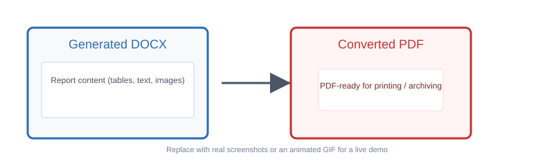
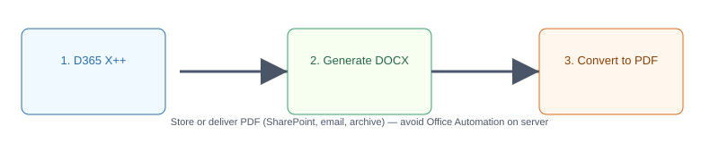

# D365DocxPDF
Mastering DOCX Generation & PDF Conversion in Dynamics 365 Finance & Operations Using X++ and Open XML SDK

## Overview
This repository collects patterns, examples, and helper code for generating Microsoft Word (DOCX) documents from Dynamics 365 Finance & Operations (D365FO) using X++ and for converting those DOCX files to PDF.

The goal is to demonstrate practical, maintainable approaches you can use in D365FO customizations: templated DOCX generation via Open XML-compatible structures and safe, server-friendly strategies for producing PDF output.

## Features
- X++ examples that show how to produce DOCX programmatically
- Guidance for using Open XML SDK patterns (structure, content controls, templating)
- Notes on DOCX → PDF conversion approaches suitable for D365FO environments
- Best-practice considerations for performance and security when generating documents server-side

## Prerequisites
- Dynamics 365 Finance & Operations development environment
- Visual Studio with the D365FO development tools
- Familiarity with X++ and the D365 model/build/deploy process
- (Optional) Open XML SDK and/or a DOCX-to-PDF conversion tool or service

## Quick start
1. Clone the repository:

   git clone https://github.com/binhtamn/D365DocxPDF.git

2. Open the solution or add the provided X++ source files to your D365FO model in Visual Studio.
3. If the samples rely on the Open XML SDK client-side tooling for inspection or local testing, add the appropriate NuGet package (DocumentFormat.OpenXml) to your helper projects used outside the D365FO runtime.
4. Build and deploy the model/package to your development environment following standard D365FO deployment steps.
5. Run the included X++ jobs or sample forms to produce DOCX files. For PDF output, use a supported server-side conversion approach (cloud conversion service, headless conversion tool, or a supported Office document service). Avoid Office Automation on server environments.

Notes:
- Exact deployment and configuration steps depend on how you structure your model and the target environment. Treat the samples as patterns to adapt, not turnkey production code.

## Examples
See the code and sample jobs in this repository for concrete patterns. (If you don't see an examples folder, check the X++ classes and jobs included in the project.)

## Usage
Below are illustrative assets showing the DOCX → PDF conversion flow. These are visual guides — replace them with real screenshots or GIFs from your environment for a more accurate walkthrough.

- The first image is a placeholder 'screenshot' showing a generated DOCX and resulting PDF.
- The second image is a small flow diagram describing: D365 X++ -> Generate DOCX -> Convert to PDF -> Store/Deliver.

To replace these with real screenshots or an animated GIF:
1. Add your images to the `assets/` directory (e.g., `assets/screenshot.png` and `assets/convert.gif`).
2. Update the README image links above to point to the new filenames.

## Contributing
Contributions, issues, and pull requests are welcome. Please open an issue to discuss major changes before creating a pull request. Follow repository coding conventions and include tests or usage notes where applicable.

## License
See the LICENSE file in this repository for license details.
